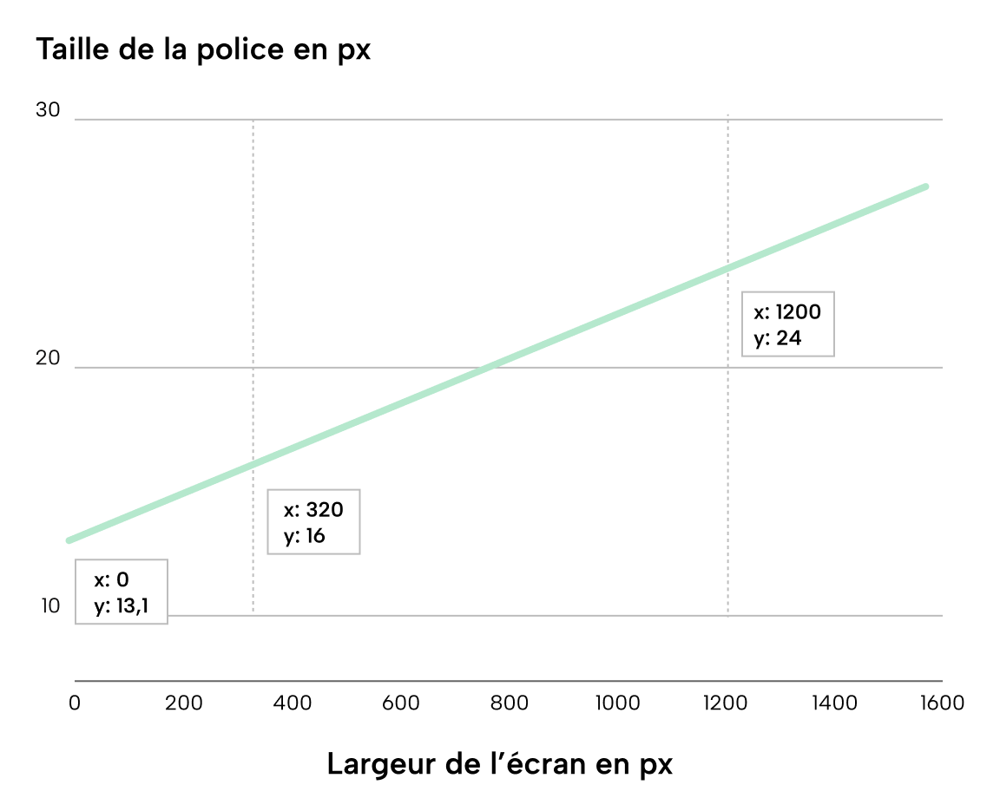

Depuis quelques temps, j'ai pris l'habitude d'utiliser des tailles de texte fluides. On définit deux tailles: une pour une largeur minimale et l'autre pour la largeur maximale. Dans l'intervalle, le texte s'agrandira en fonction de la largeur en cours, sans avoir à passer par de multiples media queries.

Pour ce faire, j'utilise [Utopia](https://utopia.fyi/), qui permet de générer le code CSS de chaque intervalle de taille. Cela ressemble à ça:

```css
/* Pour une taille de 16px à 320px et 24px à 1200px*/
:root {
  --step-0: clamp(1rem, 0.8182rem + 0.9091vi, 1.5rem);
}
```

La fonction clamp permet de définir des valeurs minimales et maximales à ne pas dépasser (respectivement 1rem et 1.5rem).
Depuis que je les utilise, les valeurs du deuxième paramètre restent un mystère pour moi (le `0.8182rem + 0.9091vi`).
Pour essayer de comprendre ça, ressortons les vieux manuels de math.

## Calculer le coefficient

Pour comprendre le calcul nous prendrons une valeur de 16px à 320px et 24px à 1200px.

On peut aisément représenter ces deux valeurs sur un graphique, x étant la largeur de l'écran et y la taille en pixel.


Pour obtenir la taille à partir d'une largeur (soit y en ayant x), il faut calculer le coefficient (m) qui permet de passer de l'une à l'autre. Pour cela, il suffit de diviser la longueur de l'intervalle y divisé par l'intervalle x.


Ce calcul va nous permettre de répondre à la question: entre ces deux hauteurs, combien y aura de marches, et quelle hauteur représentera une marche ?
Le calcul est plus simple qu'il n'y parait:
`coefficient = (y2 - y1) / (x2 - x1)`
Avec notre exemple, cela donne:

```
coefficient = (24 - 16) / (1200 - 320)
coefficient = 8 / 880
coefficient = 0,009090909091
```

Pour 8 de hauteur, il y aura 880 marches, qui feront 0,00909 de haut.


Ce coefficient est utilisé par Utopia en combinaison avec l'unité vi qui correspond à 1% de la taille de la zone d'affichage sur l'axe en ligne. Il s'agit de notre variable coefficient multipliée par 100. On pourrait tout à fait la remplacer par 0,00909vw.
A 1200px, on aurait donc la calcul suivant:

```
1200px = 1vw = 100vi
1200px * 0,00909 = 1vw * 0,009090909091 (soit 0,009090909091vw)
1200px * 0,00909 = 100vi * 0,009090909091 = 1vi * 0,9090909091 (0,9090909091vi)
```

On a donc notre second chiffre du calcul. Reste donc à trouver le premier.

## Calculer la taille pour une largeur

Le coefficient va donc nous permettre de calculer une taille pour une largeur d'écran donnée. Si l'on suite le calcul précédent, il suffit donc de multiplier la largeur d'écran par ce coefficient. Prenons 1200px:

```
y = 0,09090909091 * 1200
y = 10,9090909092
```

Pourquoi trouve-t-on 10,9 au lieu de 24 ?
Si l'on reprend l'analogie, on a donc gravi 1200 marches de 0,09vi. Mais à quelle hauteur était l'escalier au tout début ?
On serait tenté d'ajouter 16 pour avoir la bonne valeur (au passage, ça ferait 26,9 au lieu de 24, faites un effort). Pour que le calcul soit juste, il faut trouver la hauteur initiale lorsque x est à 0. Comment la calcule-t-on ?
Si l'on multiplie 320px par le coefficient, on obtient 2,9 . Ce qui veut dire qu'en avançant de 320px en largeur, on a gravit 2,9px en hauteur. Or, on sait qu'à 320px, on est à 16px. Donc à 0, on est à `16 - 320*0,00909`. Soit 13,1px.



Converti en rem (divisé par 16), cela donne
`y = 0.8182rem`

On a notre deuxième chiffre, youpi, le livre de math va pouvoir retourner dans son vieux placard.

## Recapitulatif

Pour calculer un nombre entre deux intervalles, on calcule le coefficient, représenté par le second chiffre.
En ayant ce coefficient, on peut calculer y en ayant x. Il faut toutefois ajouter la valeur initiale pour que la calcul soit juste, et c'est tout le but de la première valeur.

## Sources:

- https://www.madebymike.com.au/writing/precise-control-responsive-typography/
- https://www.smashingmagazine.com/2023/11/addressing-accessibility-concerns-fluid-type/
- https://fluidtypography.com/#app-get-started
- https://css-tricks.com/linearly-scale-font-size-with-css-clamp-based-on-the-viewport/
- https://blog.logrocket.com/fluid-vs-responsive-typography-css-clamp/
