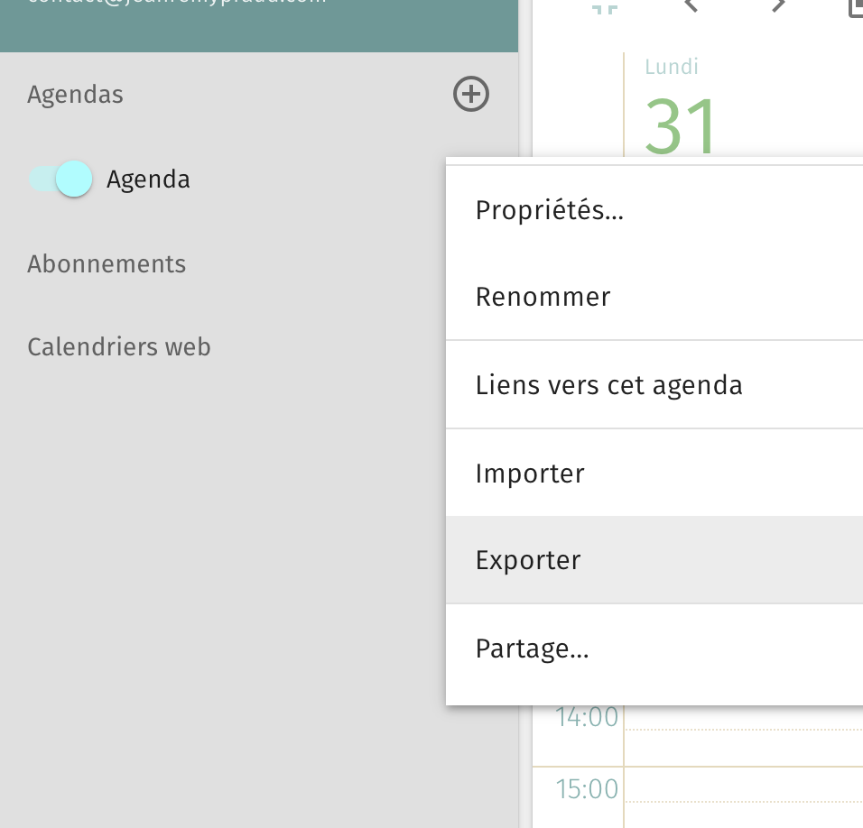
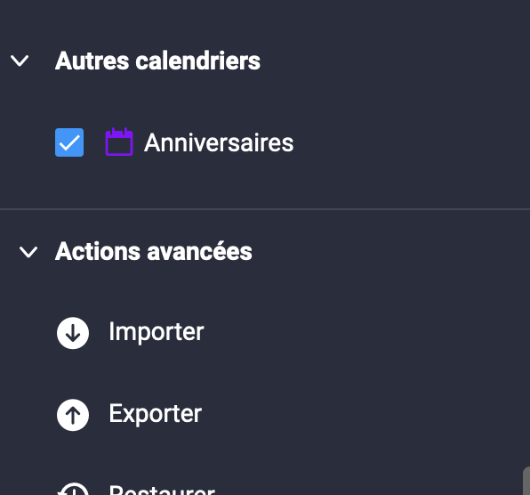

Cet article fait partie d'une série sur la migration de Sogo vers Infomaniak. On peut en retrouver une partie [ici](/notes/importer-domaine-infomaniak) et [là](/notes/importer-contacts-infomaniak). {.info}

## Exporter son agenda
Dans Sogo, sélectionner l'agenda et cliquer ensuite sur Exporter

    

## Importer l'agenda

Sur le compte Infomaniak, se rendre dans la partie Agenda. Cliquer ensuite sur importer, en bas du menu.

## Synchroniser son agenda sur Android
Il est possible de synchroniser son agenda sur téléphone avec l'application kSync.