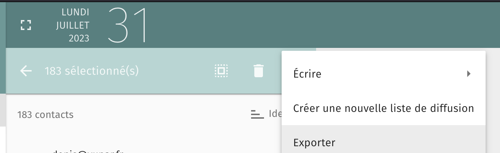
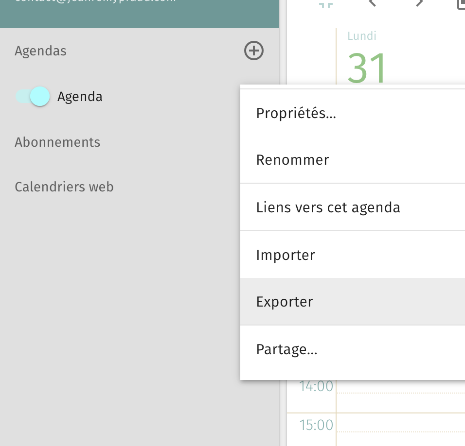
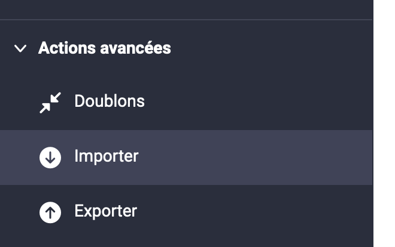
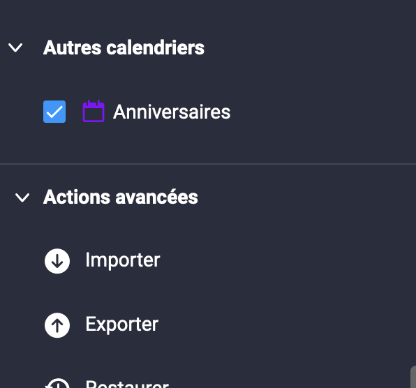

Cet article est la deuxième partie d'un article sur la migration de Sogo vers Infomaniak. On peut retrouver la première partie [ici](/notes/importer-domaine-infomaniak). {.info}

## Exporter ses contacts / agenda
Dans Sogo, sélectionner tous les contacts et cliquer ensuite sur Exporter.

 
 Pour l'agenda, sélectionner l'agenda concerné et faire Exporter.

Pour les contacts, l'export est au format `ldif`. Il est nécéssaire de le convertir pour l'importer ensuite. C'est possible via un outil en ligne, [ldif2csv](https://www.ldif2csv.com/). Pas de modification à faire pour l'agenda, la format `ics` est importable tel quel.

## Importer ses contacts / agenda

Sur le compte Infomaniak, se rendre dans la partie Contacts ou Agenda. Cliquer ensuite sur importer, en bas du menu.

## Synchroniser ses contacts sur Android
Il est possible de synchroniser ses contacts et son agenda sur téléphone avec l'application kSync.