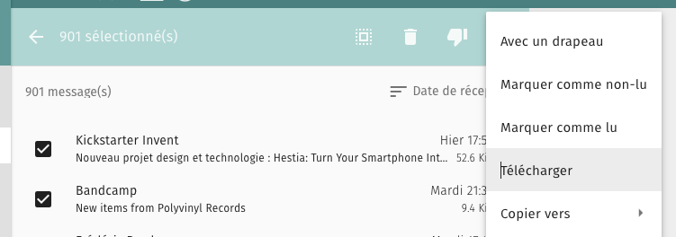
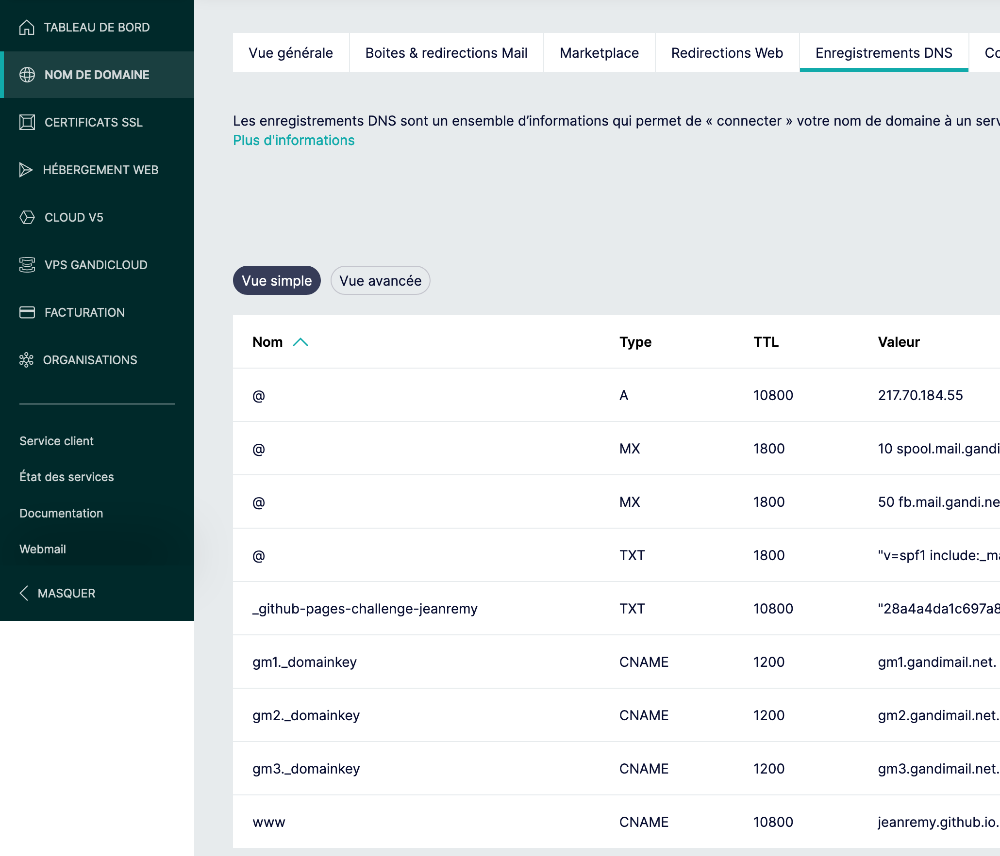
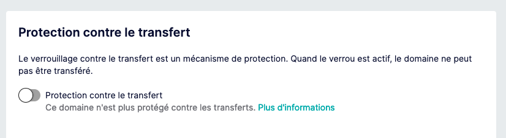
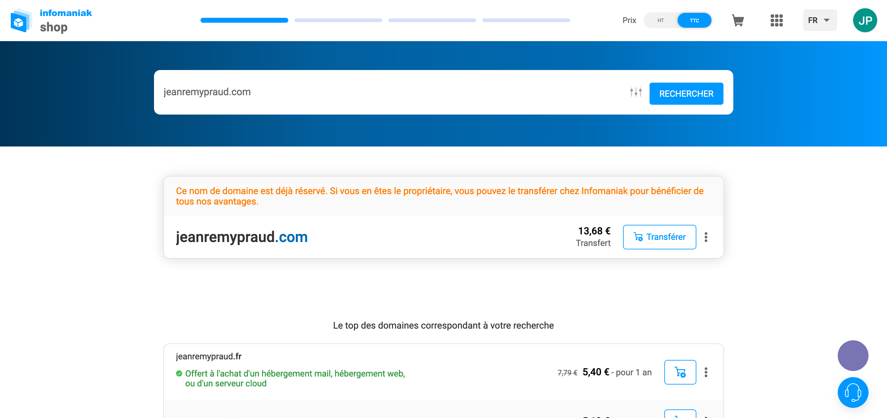
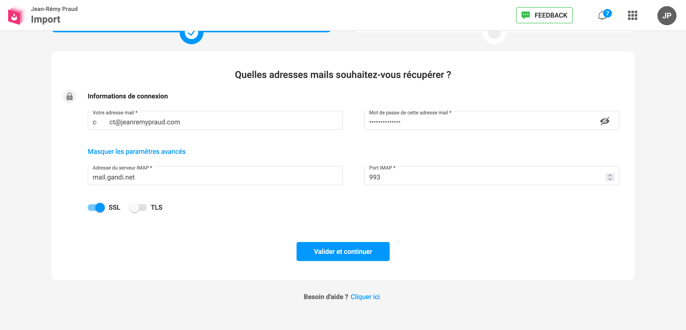

Le 13 juin 2023, Gandi a annoncé un changement dans les tarifs de ses boîtes emails, passant de 0 à plus de 4€ par mois. Bien que content du service de Gandi, le montant était trop élevé pour moi. Les changement d'hébergeur de mes emails est une opération que je fais peu et que j'évite autant que possible.
Après quelques semaines d’hésitation, j’ai donc migré mon nom de domaine vers un autre service, Infomaniak.

## Pourquoi Infomaniak ?

La principale raison est qu’Infomaniak propose des boîtes emails gratuites. Pour ne rien gâcher, un hébergement est fourni pour l’achat d’un domaine. Même si je ne l’utilise pas (ce site est hébergé sur GitHub Pages), je pourrais en trouver l’utilité. Et enfin, je trouve leur [communication relative à leur empreinte écologique](https://www.infomaniak.com/fr/ecologie) assez juste.

## Guide rapide pour migrer son domaine chez Infomaniak

1. Récupérer ses anciens mails (au cas où)

    1. Si vous utilisez Sogo, sélectionner tous les emails de la boite de réception et cliquer ensuite sur Télécharger
    
    
    2. Avec [Thunderbird](https://www.thunderbird.net/fr/), 
    configurer une boite mail. Choisir POP afin de récupérer une copie de tous les emails. Thunderbird détectera la configuration de manière automatique puis téléchargera tous les emails

2. Copier ses DNS si certaines entrées ont été modifiées

3. Désactiver la protection chez Gandi
Afin de pouvoir transférer le nom de domaine, il faut d’abord le déverrouiller. Copier ensuite le code de transfert fourni et importer le nom de domaine chez Infomaniak. 

4. Chercher un nom de domaine, et cliquer sur Transférer.

5. Entrer le code de transfert

6. Commander (et créer un compte)

7. Importer les emails chez InfoManiak
Infomaniak dispose d’un service très simple pour importer ses emails. Comme le transfert d’un nom de domaine n’est pas instantané, il est possible d’importer ses emails le temps que le transfert s’effectue. Pour cela, aller sur [https://import-email.infomaniak.com/](https://import-email.infomaniak.com/) et reentrez vos identifiants de messagerie. C’est tout.

Les sauvegardes précédemment effectuées ne seront donc pas utiles (en théorie).

8. Réécrire sa zone DNS

## Conclusion

Dans mon cas, le transfert a pris 5 jours. J'ai pu donc migrer mon nom de domaine et mes emails sans trop de souci grâce au service d'Infomaniak qui facilite grandement la tâche.