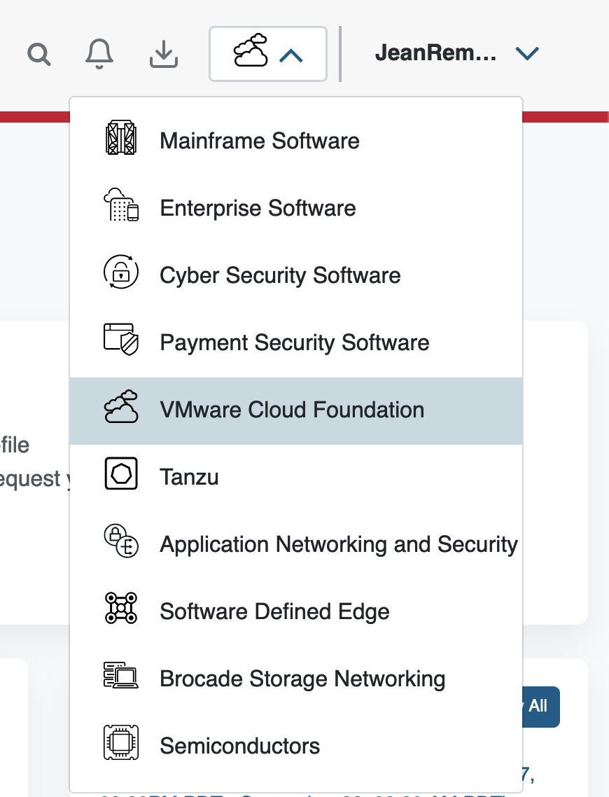
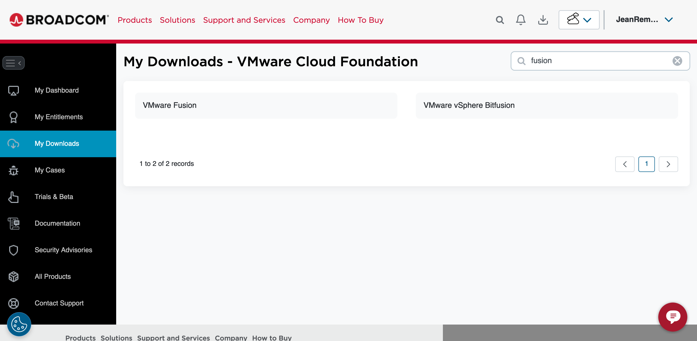
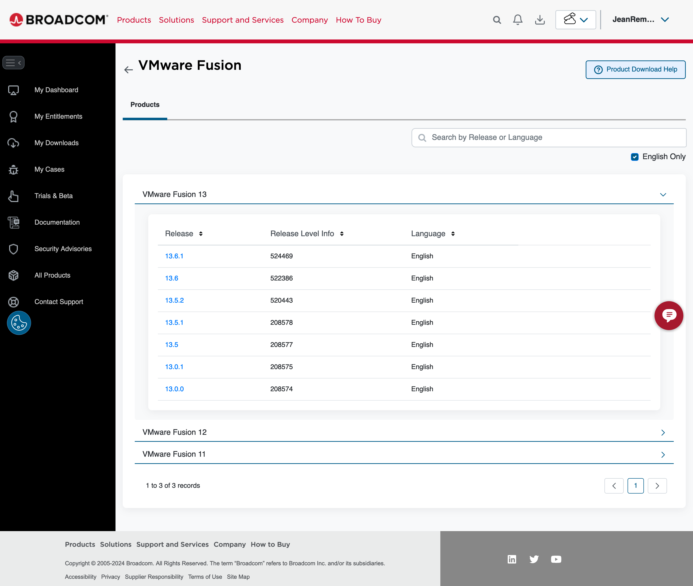
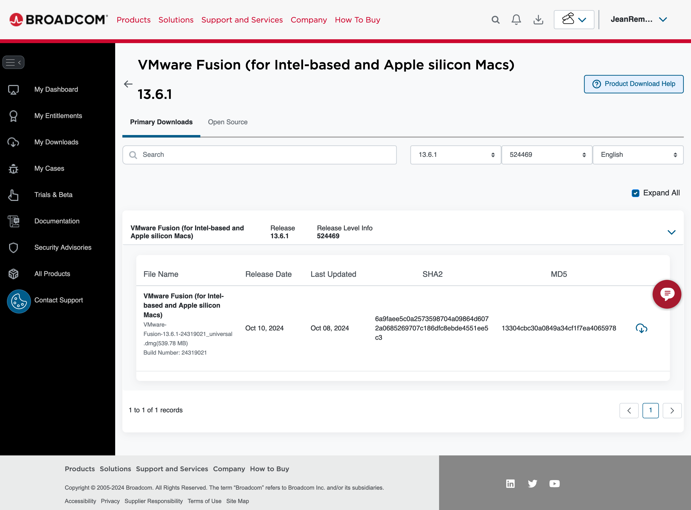
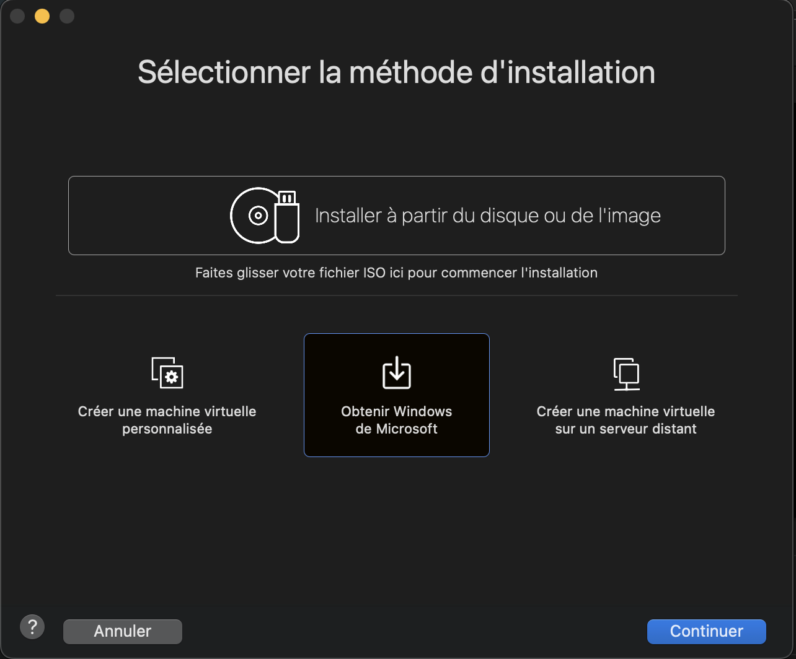
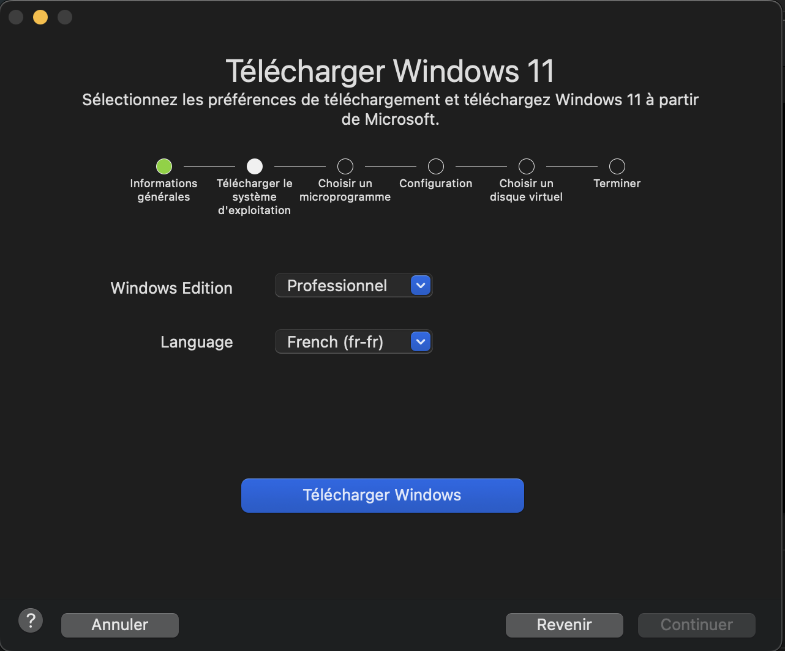
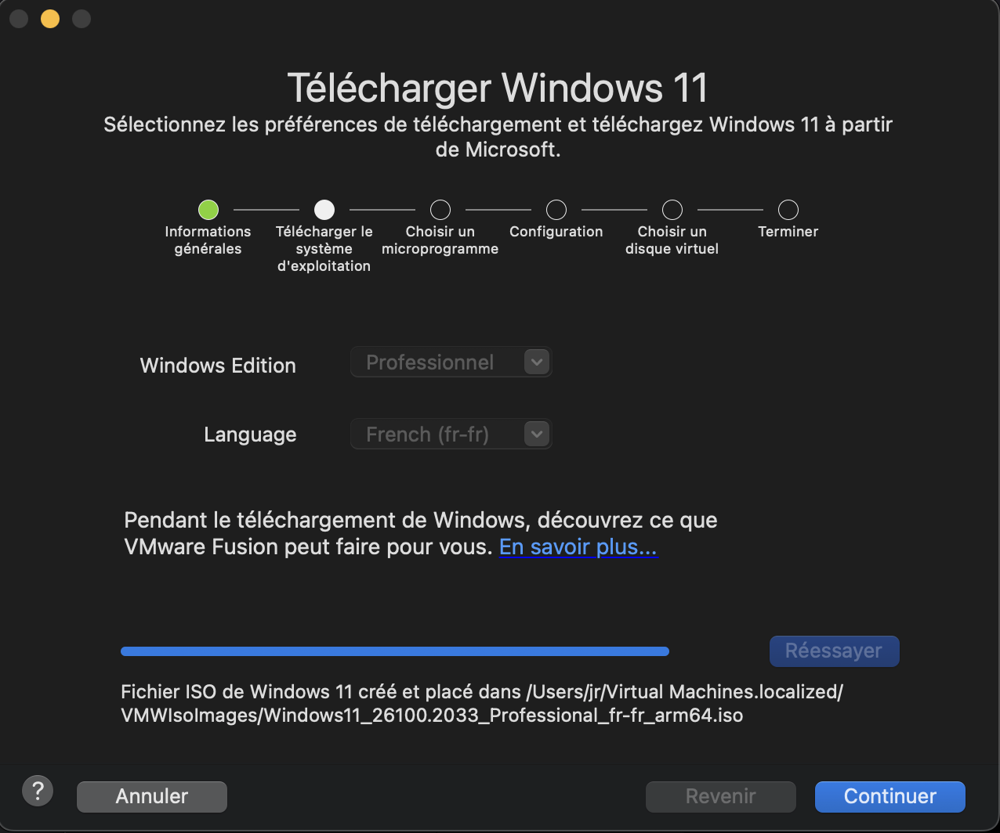
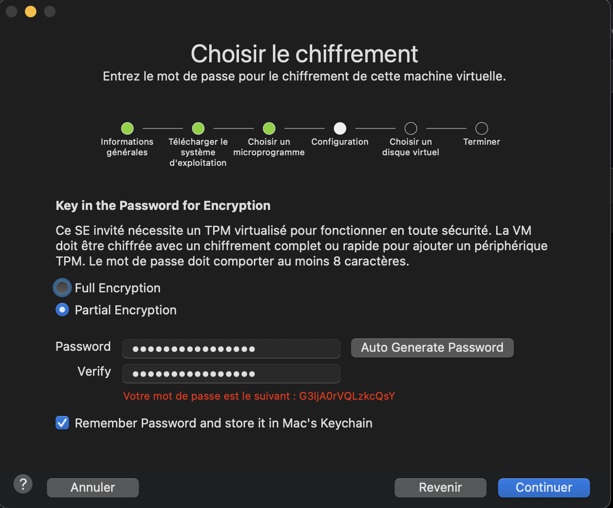
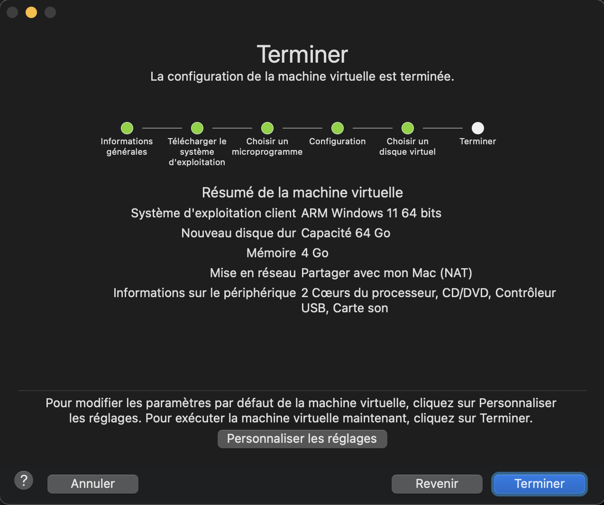
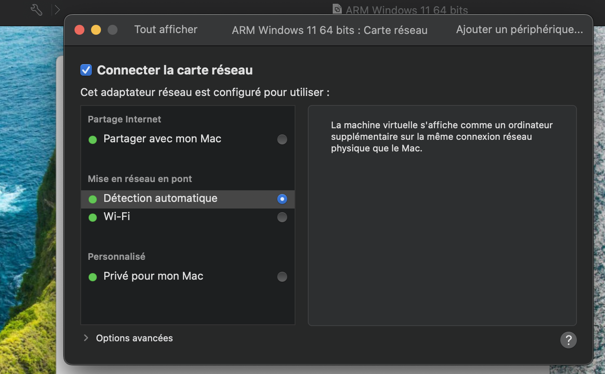

Auparavant, il était possible de télécharger de petites images disques de Windows avec une version d’essai d’IE. Plusieurs formats étaient disponibles (VirtualBox ou VMWare de mémoire), ce qui se révelait bien pratique pour tester le rendu navigateur ou les lecteurs d’écran. Malheureusement, ces images ne sont plus accessibles.

Voici donc une nouvelle façon de faire, avec VMWare Fusion, édité par Broadcom. C’est assez tentaculaire, d’où cette prise de notes.

Attention, les étapes et les intitulés changent souvent, ce guide peut donc se révéler incomplet ou erroné rapidement.

## Télécharger VMWare Fusion

Tout d’abord, cela nécéssite de créer un compte Broadcom. Pour cela, se rendre sur https://profile.broadcom.com/web/registration

Lorsque le compte est créé, se rendre sur https://support.broadcom.com/ et sélectionner en haut à droite VMWare Cloud Foundation

Dans le menu My downloads, rechercher Fusion

Cliquer sur VM Ware Fusion. Choisir la dernière version (13.6.1 dans mon cas).

Télécharger la dernière version en cliquant sur l'icône en forme de nuage.

Lorsque le fichier est téléchargé, lancer l’installation en double cliquant dessus.

## Installer VMWare

L’installation est assez facile, il suffit de suivre les étapes.

Tout d’abord, sélectionner "Obtenir Windows depuis Microsoft".

Sélectionner ensuite la langue adaptée.

Télécharger Windows, puis suivre ensuite toutes les étapes en sélectionnant les choix par défaut.

Lancer ensuite la machine virtuelle (VM). Attention à bien appuyer sur un touche au démarrage de la VM, sinon Windows ne se lancera pas.

Ensuite Windows devrait s'installer normalement, il suffit de suivre les étapes (ça reste un peu fastidieux, notamment la création d'un compte, oui, encore un).

## Tester sur la VM

Pour que la VM puisse communiquer avec le local du Mac, il faut que la carte réseau soit “Bridged” ou en mode Pont, dans la langue de Molière.

Une fois fait, retour sur le Mac pour trouver son IP sur le réseau.

Avec cette commande, on retrouve une liste d’IPv4: `ifconfig | grep "inet " | grep -v 127.0.0.1 | cut -d\ -f2`

Dans mon cas, la deuxième à marché, j’ignore pourquoi.

Pour tester, rendez vous dans le navigateur sur Windows, et essayer l’ip dans la barre d’adresse: `http://10.1.34.34:8084` Le port dépend de celui de votre projet.

Avec tout ça, il est normalement possible de tester des sites qui sont en local avec des synthèses vocales. Pour cela, on peut suivre [le précieux guide de Sara Soueidan](https://www.sarasoueidan.com/blog/testing-environment-setup/#download-nvda-screen-reader-on-windows) sur le sujet.
