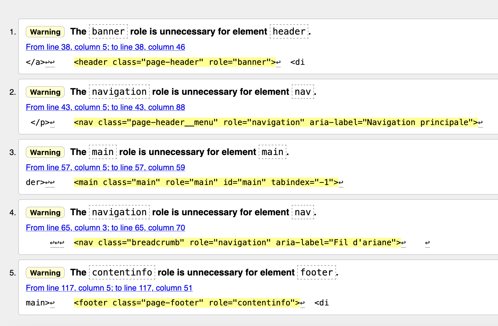
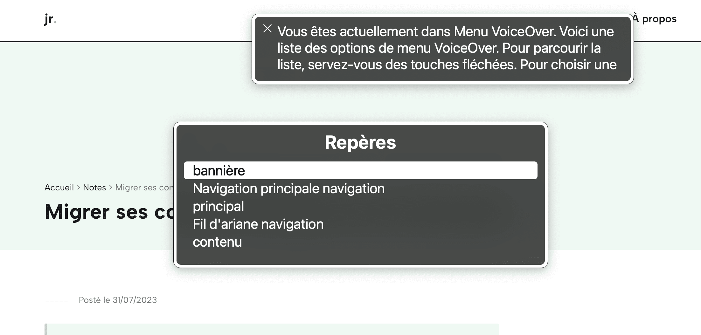

Je tombe régulièrement sur un avertissement lors de la validation de mes pages au validateur W3C:

```html
The banner role is unnecessary for element header
```

Il en est de même pour la balise main, nav, footer et aside. Alors, faut-il ignorer ces warnings ou retirer les attributs role ?



## Que sont les landmarks ?

Les landmarks sont les zones principales d’une page web, telles que la zone de contenu, la zone d’en-tête, de recherche, de navigation ou de pied de page.

Il existe 8 rôles:

- [banner](https://w3c.github.io/aria/#banner)
- [complementary](https://w3c.github.io/aria/#complementary)
- [contentinfo](https://w3c.github.io/aria/#contentinfo)
- [form](https://w3c.github.io/aria/#form)
- [main](https://w3c.github.io/aria/#main)
- [navigation](https://w3c.github.io/aria/#navigation)
- [region](https://w3c.github.io/aria/#region)
- [search](https://w3c.github.io/aria/#search)

Ces landmarks permettent aux technologies d’assistance d’identifier les principales zones de pages afin de pouvoir naviguer plus rapidement entre elles.



## Comment créer ces zones ?

Pour créer ces zones, il faut donc appliquer les roles aria aux balises structurant la page web.

```html
<header role="banner">
  <nav role="navigation" aria-label="Navigation principale"></nav>
</header>
<main role="main">
  <nav role="navigation" aria-label="Fil d'ariane"></nav>
</main>
<footer role="contentinfo"></footer>
```

## Pourquoi cet avertissement ?

Le validateur du W3C renvoie un avertissement car il considère que ces balises ont un rôle implicite, lorsque [celles-ci sont dans le contexte du body](https://www.w3.org/WAI/ARIA/apg/patterns/landmarks/examples/HTML5.html).

Toutefois, il est préférable d’ignorer cet avertissement qui n’entrave pas la validation du code. [La régle 12.6 du RGAA](https://accessibilite.numerique.gouv.fr/methode/criteres-et-tests/#12.6) demande que _les zones de regroupement de contenus présentes dans plusieurs pages web (zones d’en-tête, de navigation principale, de contenu principal, de pied de page et de moteur de recherche) puissent être atteintes ou évitées_. Et parmi les moyens mis en oeuvre, l’ajout de role aria est la solution la plus rapide et la plus simple

Il semblerait également que le rôle soit nécéssaire pour des questions de rétro compatibilité: VoiceOver n’exposait pas correctement le role du footer avec Safari 13.

Même si cela peut paraitre redondant, l’ajout de rôle aux balises structurantes est donc nécéssaire, notamment pour valider une règle du RGAA. On peut donc ignorer cet avertissement.
