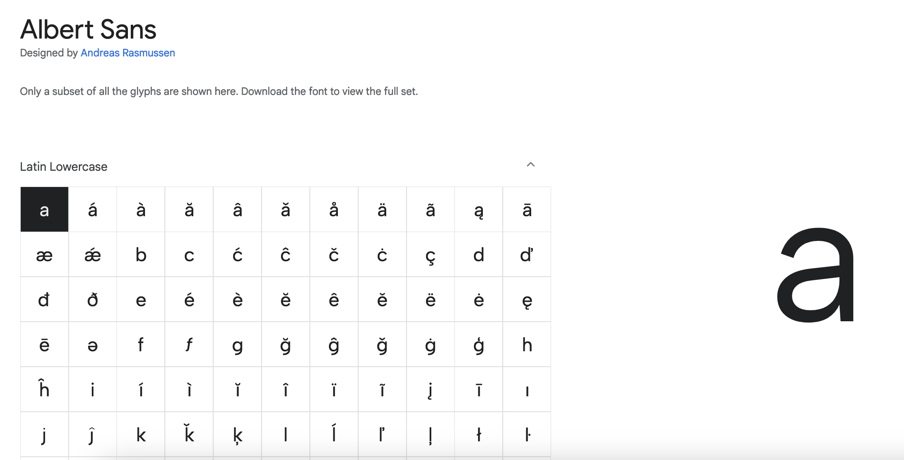

Lorsque l'on utilise une police custom sur le web, il est rare que la totalité des glyphes soit utilisée.

Dans une optique d'efficience, il peut être intéressant de vouloir supprimer ces signes typographiques inutiles. Et c'est là que la [librairie Glyphhanger](https://github.com/zachleat/glyphhanger) entre en jeu.



Glyphhanger permet de réduire le poids d'une police, mais permet aussi de définir un sous-ensemble (subset) de caractères que l'on souhaite garder dans un fichier séparé.

Avant toute chose, il faut s'assurer que supprimer des glyphes est autorisé par la licence de distribution de la police. Une liste (partielle) de fontes l'autorisant est disponible sur le site [subsetting.xyz](https://subsetting.xyz/). A noter que les Google Fonts le permettent via la licence [SIL Open Font License](https://en.wikipedia.org/wiki/SIL_Open_Font_License).

## Réduire la poids

Il est possible de simplement réduire le poids de sa fonte en une seule ligne de commande.

```bash
glyphhanger --subset=AlbertSans.ttf

Subsetting AlbertSans.ttf to AlbertSans-subset.ttf (was 125.41 KB, now 122.57 KB)
Subsetting AlbertSans.ttf to AlbertSans-subset.zopfli.woff (was 125.41 KB, now 59 KB)
Subsetting AlbertSans.ttf to AlbertSans-subset.woff2 (was 125.41 KB, now 49.78 KB)
```

**Quel format utiliser ?**

J'utilise le format woff2 qui supporte les fontes variables et dont [le support est très élevé](https://caniuse.com/?search=woff): 97.15%. Il est conseillé d'ajouter woff en fallback.

La police a été réduite de 53% en woff et jusqu'à 61% au format woff2. Elle contient néanmoins de nombreux glyphes qui ne seront pas utilisés, laissant une place à l'optimisation.

## Définir un subset

Pour choisir le sous-ensemble (subset) de caractères que l'on souhaite conserver, plusieurs options s'offre à nous.

### Passer une liste de caractères en _whitelist_

Si la liste de glyphes est relativement courte (dans le cas d'une fonte d'icônes complète par exemple), il est relativement aisé de passer directement les caractères que l'on souhaite conserver.

```bash
glyphhanger --subset=AlbertSans.ttf --whitelist=abcdefgh
```

L'application [Character table](https://character-table.netlify.app/) permet d'obtenir la liste des glyphes à retenir par langue. Il suffit de copier la liste et la passer en whitelist.

### Passer un subset prédéfini

Glyphhanger prédéfini des subsets, comme LATIN et --US_ASCII.

```bash
glyphhanger --LATIN --subset=AlbertSans.ttf
```

Ces deux options sont intéressantes, car l'on garde qu'une liste définie de caractères. Toutefois, il est possible d'oublier certaines caractères utilisés dans les pages.

### Passer une URL

Il est possible de passer à l'outil une URL d'où il tirera tous les glyphes nécéssaires. Il peut parcourir plusieurs pages grâce à l'option `--spider` ou `--spider-limit`.

```bash
glyphhanger http://localhost:8080/notes --spider-limit=0 --subset=AlbertSans.ttf --formats=woff2
```

L'intérêt de cette méthode est de créer un subset qui contient tous les glyphes des pages.

Mais que se passe-t-il si un utilisateur traduit le contenu (via Google translate par exemple), et que des glyphes non prévus doivent être affichés ?

## Organiser les subsets

Il existe une propriété CSS qui permet d'associer une fonte à une liste de caractères: `unicode-range`. On peut donc définir un subset avec tous les glyphes utilisés (via `spider`) ou présents dans une langue et un autre subset avec tous les caractères manquants, puis associer les fichiers générés avec le bon interval unicode.

Quelques précisions sur la propriété `font-face`:

- Il est possible de déclarer plusieurs fichiers pour une même fonte. Les navigateurs se chargent ensuite de merger les déclarations, comme [le présente Jake Archibald](https://jakearchibald.com/2017/combining-fonts/).
- Si un ou des caractères sont présents dans plusieurs déclarations via unicode-range, c'est la dernière qui sera effective.

En résumé, on peut donc créer les subsets par langue (ici en français), puis par interval unicode:

```bash
glyphhanger --subset=AlbertSans.ttf --output=custom --formats=woff2,woff --whitelist=U+0000-00A0,U+00A2-00A9,U+00AC-00AE,U+00B0-00B7,U+00B9-00BA,U+00BC-00BE,U+00D7,U+00F7,U+2000-206F,U+2074,U+20AC,U+2122,U+2190-21BB,U+2212,U+2215,U+F8FF,U+FEFF,U+FFFD,U+00A1,U+00AA-00AB,U+00AF,U+00B8,U+00BB,U+00BF-00D6,U+00D8-00F6,U+00F8-00FF,U+0131,U+0152-0153,U+02B0-02FF

glyphhanger --subset=AlbertSans.ttf --formats=woff2,woff


```

```css
/* la police générique qui contient tous les signes */
@font-face {
  font-family: "Albert Sans";
  src: url("../fonts/AlbertSans.woff2") format("woff2"), url("../fonts/AlbertSans.woff")
      format("woff");
}

/* La police du subset, déclarée en dernière, qui sera donc préférée par les navigateurs lorsqu'ils rencontreront les glyphes présents */
@font-face {
  font-family: "Albert Sans";
  src: url("../fonts/custom/AlbertSans.woff2") format("woff2"), url("../fonts/custom/AlbertSans.woff")
      format("woff");
  /* French unicode range fetched from https://character-table.netlify.app/french/ */
  unicode-range: U+20-5F, U+61-7A, U+7C, U+A0, U+A7, U+A9, U+AB, U+B2-B3, U+BB,
    U+C0, U+C2, U+C6-CB, U+CE-CF, U+D4, U+D9, U+DB-DC, U+E0, U+E2, U+E6-EB,
    U+EE-EF, U+F4, U+F9, U+FB-FC, U+FF, U+152-153, U+178, U+2B3, U+2E2,
    U+1D48-1D49, U+2010-2011, U+2013-2014, U+2019, U+201C-201D, U+2020-2021,
    U+2026, U+202F-2030, U+20AC, U+2212;
}
```

Attention à l'unité de mesure `ch`. Firefox charge indifférement les deux polices si l'unité ch est utilisée quelque part dans le CSS. ~~Un [ticket](https://bugzilla.mozilla.org/show_bug.cgi?id=1962602) est ouvert à ce sujet.~~ Edit, le bug a été [corrigé](https://bugzilla.mozilla.org/show_bug.cgi?id=1962602).

## Crédits

Pour rédiger ce billet, je me suis beaucoup aidé du blog de [Markos Konstantopoulos](https://markoskon.com/creating-font-subsets/), de la [documentation de Glyphhanger](https://github.com/zachleat/glyphhanger) ainsi que de [cet échange Mastodon qui m'a mis sur la piste du unicode-range](https://mastodon.design/@carbontwelve@notacult.social/109882845407952893).
