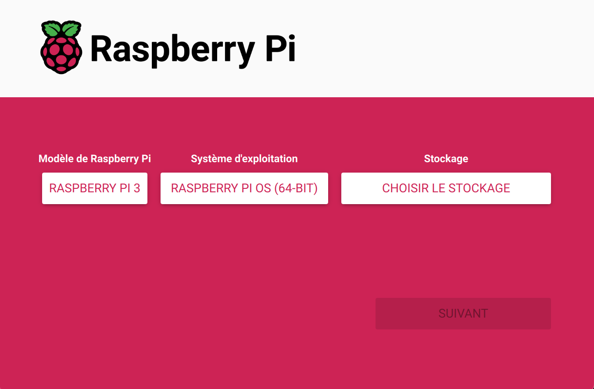
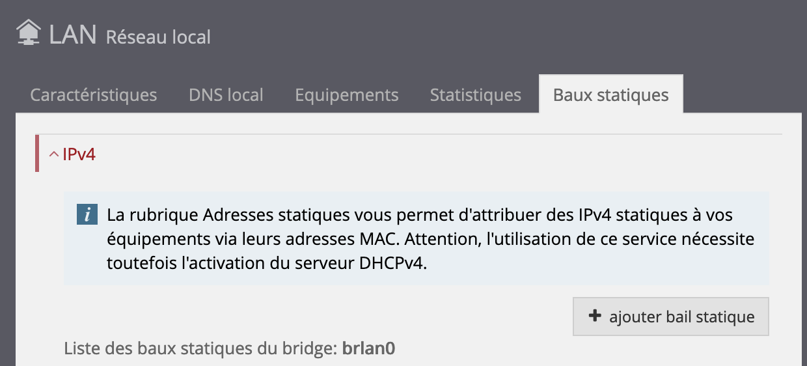
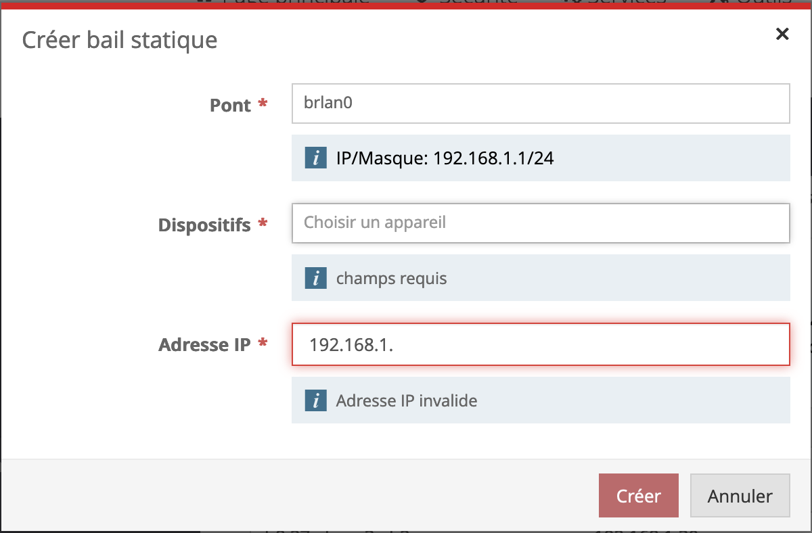
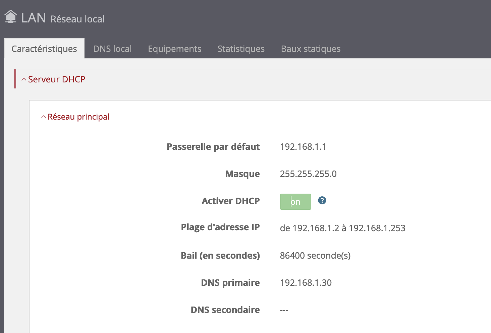
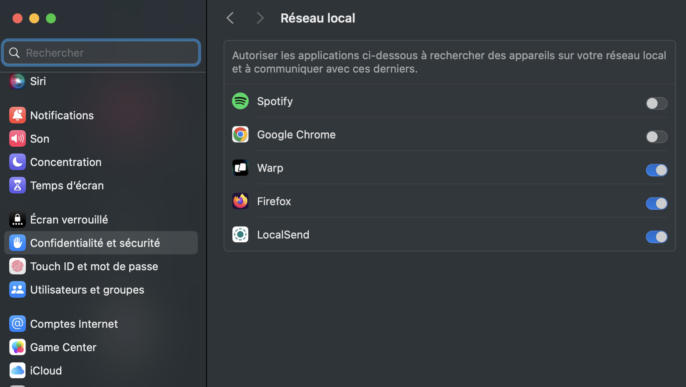
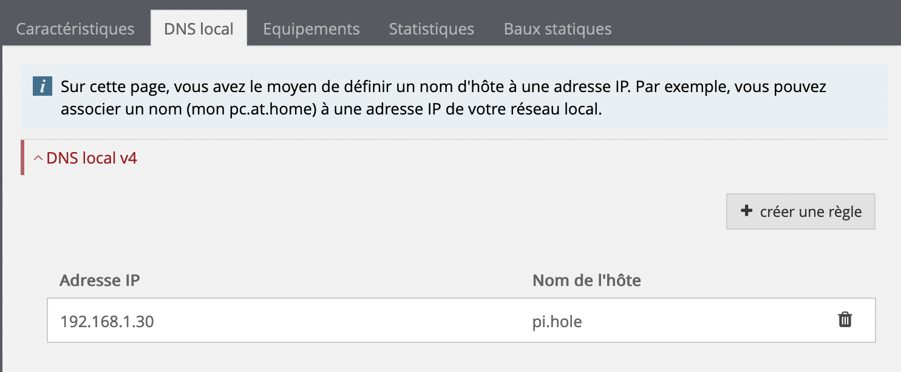

En quelques minutes, il est possible d'installer chez soi un bloqueur de pubs avec [Pi-Hole](https://pi-hole.net/).

Pour cela, j'ai utilisé:

- Un Raspberry Pi (mobèle 3B)
- Un câble Ethernet pour le relier à la box
- Une carte micro SD de 16 Go

## Fonctionnement

Sur le réseau local, Pi-Hole agit comme serveur DNS disposant d'une liste de domaines indésirables. Lorsqu'une requête pointe vers un de ces domaines, le serveur répond par une page vierge. Contrairement aux bloqueurs de pub qui s'installent dans les navigateurs de chaque périphérique, Pi-Hole s'éxécute sur le réseau, et bénéficie donc à tous les périphériques connectés.

## Installer Raspberry Pi OS

Si ce n'est déjà fait, il faut installer un OS sur la carte SD afin que le Raspberry Pi puisse fonctionner. e processus s'est grandement amélioré avec le sortie de [Raspberry Pi Imager](https://www.raspberrypi.com/software/#:~:text=Raspberry%20Pi%20Imager). Il suffit de télécharger le logiciel, puis de se laisser guider.
Il suffit de choisir l'OS et de sélectionner quelques options, comme l'activation de SSH, l'activation du wifi, etc.



## Configuration réseau

Pour que Pi-Hole puisse fonctionner, il faut attribuer au Raspberry Pi un IP locale statique dans l'interface d'administration de la box, accessible à l'adresse [http://192.168.1.1/](http://192.168.1.1/).
Le mot de passe par défaut varie en fonction des modèles. Une liste complète est disponible [ici](https://actuneuf.com/tutoriel/interface-box-sfr).

Pour ajouter une IP statique, il faut se rendre dans la partie LAN, puis l'onglet Baux statiques. Cliquer sur Ajouter un bail statique.



Ensuite, il suffit de sélectionner l'équipement et lui attribuer une IP quelconque (192.168.1.30 dans mon cas).



## Installer Pi-Hole

Le Raspberry Pi est maintenant prêt à être configuré. Pour se connecter en SSH, il suffit de lancer la commande suivante

```bash
> ssh pi@192.168.1.30
```

`pi` est l'utilisateur par défaut et `192.168.1.30` l'IP précédemment attribuée. Dans ce cas, le mot de passe par défaut est `raspberry`, mais il peut être défini lors du processus d'installation de l'OS (voir plus haut).

On peut ensuite lancer la commande d’installation de Pi-Hole:

```bash
> curl -sSL https://install.pi-hole.net | bash
```

La configuration propose plusieurs choix de fournisseurs de DNS. Il faut donc bien lire [la documentation](https://docs.pi-hole.net/guides/dns/upstream-dns-providers/) avant de choisir. De mon côté, j’ai choisi OpenDNS pour son filtre anti-phising et le filtre familial.

Une fois l'installation terminée, l’interface de Pi-Hole est accessible à http://192.168.1.30/admin/index.php.

## Configuration finale

Pi-Hole fonctionne, il faut maintenant le définir comme DNS primaire. Pour cela, dans la partie LAN de l'interface de la box, on peut entrer l'IP du Raspberry comme DNS primaire.



Toutes les requêtes transiteront désormais vers le Raspberry Pi, qui pourra filtrer selon ses règles.

## Autorisation sur MacOS

Sur MacOS version 15 (Sequoia), il faut veiller à ce que le navigateur ait les droits pour accéder au réseau local, sans quoi il sera impossble d'accéder au dashboard de Pi-Hole. Pour cela, il faut autoriser l'accès en se rendant dans Réglages système / Confidentialité et sécurité / Réseau local.



## Bonus

Il est également possible d’ajouter une URL locale qui permettra d’accéder à l’interface d’admin de Pi-Hole via l’url pi.hole/admin/. Tous les utilisateurs du réseau local y auront accès.


